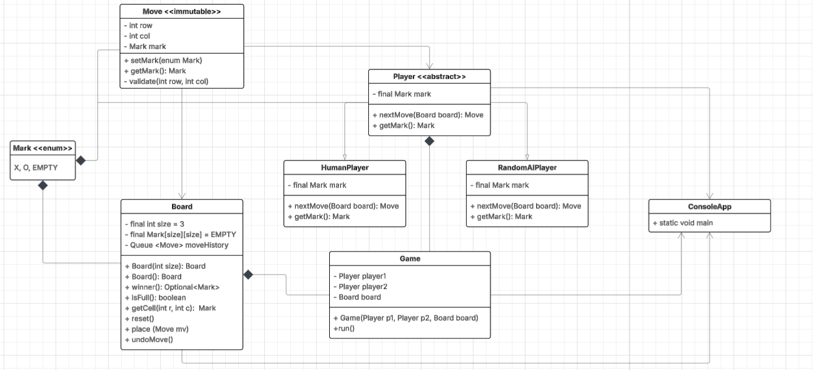

# Tic Tac Toe
Created by: Cedar Hudgens and Jazmin Carlos for CS 3560

## UML Diagram

## Chosen Extensions
1. nxn board: the board can be of any size and the win conditions will still be met. 
2. undo: On their turn, human players have the option to undo their last move. This will also undo the action of the player
who played after them. 

## Reflection
1. Where did encapsulation prevent bugs?  
    Encapsulation is shown in every class presented here. Using the Mark enum prevented any
unapproved values from being used for a Mark. For example, it is not possible to mark a square with "I".
Additionally, the Mark for one Player can only be set at the time of that player's creation since it is contained
within the Player object. A setter for this does not exist because it shouldn't be able to change after the game has begun. 
For the board class, the only way to change a Mark is to go through the "place" method, 
which will ensure that all changes are made according to the rules of the game.   
  
2.  Why inheritance here (vs. strategy/composition)?  
    Using inheritance makes gameplay easier, since only the "Player" object needs to be referred to in the Game class.
This means that no matter how many game types we may want to implement (Human-Human, Human-AI, AI-AI, or even additional players not created here)
the Game class does not need to be changed. Changes, instead, would only need to be made on ConsoleApp. This allows for modularity
within gameplay. Additionally, it makes the programming easier on us, as we can rely on methods inherited from the abstract Player class.   

3.  What would you refactor if the rules changed to 4‑in‑a‑row on a 5×5 board
    Since we have implemented the ability to choose what size board the players would like to use, we would not need to change
anything about the sizing. However, 4-in-a-row would require some changes. We would need to add additional helper functions to detect
when 4-in-a-row would occur. There are a lot more possibilities for this on a 5x5 board than 5-in-a-row on the same board. 
I think that this might best be implemented by checking the surrounding cells every time a cell is placed for the same Mark. 
If there is a Mark there, we check if there is a Mark next to that one (etc). This would be much more complicated to implement than 
our current algorithim. However, due to our setup, the only changes that would need to be made are in the Board class. All other classes 
would remain the same. 